 
 <div align = "center">
 
<h2>🧐 Cracking the Code: My Unforgettable Journey through Google's Secret Coding Challenge : "Google Foobar" 🧐 </h2> 


<br>

<p>
I was eagerly browsing for information on the <b>Observer design pattern </b>for my academic course exam when, out of nowhere blue, an unexpected website called <b>Google Foobar </b>presented itself to me. I was curious and fascinated, so I dove into its mysterious depths and found <b>an exclusive coding challenge that only a select few lucky people get to take part in.</b>
</p>
 

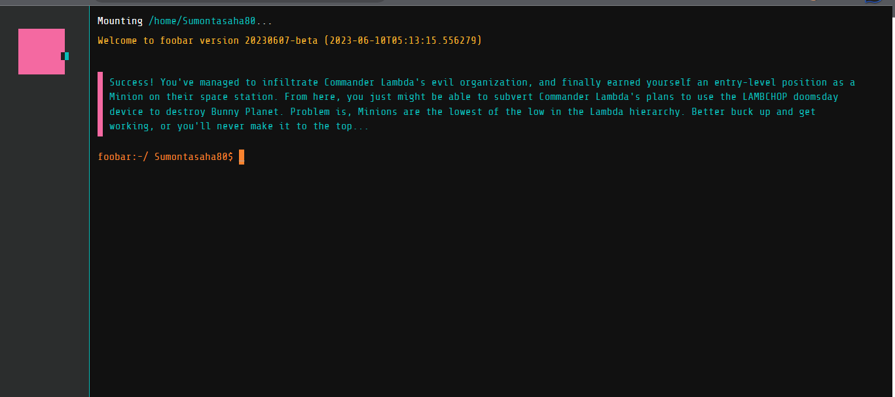

<br>

Fortunately, I was <b>able to pass Level 2</b>, which gave me a sense of achievement and fresh confidence. Now that Level 3 is approaching, there is a whole new world of challenging riddles and complex algorithms to solve. The next part of this surprising experience excites me, and I joyfully welcome it, testing my coding skills.


<h3>😊 Sharing every step of my journey of Google Foobar 😊</h3>

</div>

<hr>


##### 👉 Step 1: Need to create a account first with gmail when you first visit the site 

##### 👉 Step 2: in command Line Write
```code
    - foobar:~/ Sumontasaha80$ request      
    // It means you are requesting for your first question of the challenge
```

##### 👉 Step 3: Level 1 Problem : "Skipping Work" 🙁

##### 👉 Step 4: Now to get the question and its constraints need to write the following commands 🙁
```code
    - foobar:~/ Sumontasaha80$ ls                            // list the contents of the current directory

    ** Output : **
    journal.txt
    skipping-work
    start_here.txt

    - foobar:~/ Sumontasaha80$ cd skipping-work              // change your working directory to folder skipping-work
    - foobar:~/skipping-work Sumontasaha80$ ls               // list the contents of the current directory
    
    ** Output : **
    Solution.java
    constraints.txt
    readme.txt
    solution.py
```

##### 👉 Step 5: How to get the question of challenge level 1
```code
    - foobar:~/skipping-work Sumontasaha80$ cat readme.txt
```
<div align = "center">
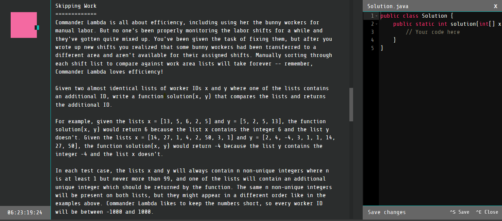
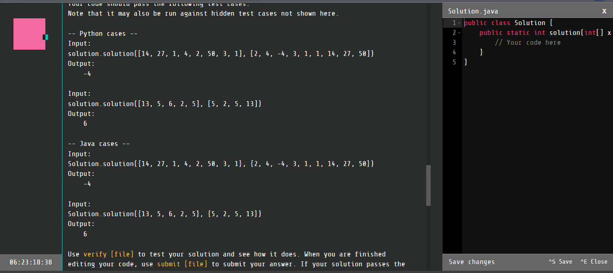
</div>

##### 👉 Step 6: How to get the constraints of challenge level 1
```code
    - foobar:~/skipping-work Sumontasaha80$ cat constraints.txt
```
<div align = "center">
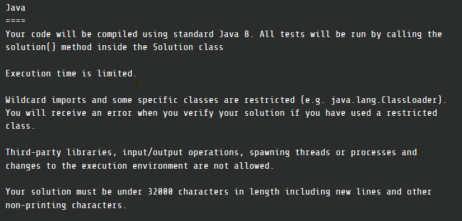
</div>

##### 👉 Step 7: How to Submit the Solution of challenge level 1
```code
    // Open Code Terminal First
    - foobar:~/skipping-work Sumontasaha80$ edit Solution.java

    // Paste or Write the Solution    
    // Save the solution

    // Verify the solution with constraints
    - foobar:~/skipping-work Sumontasaha80$ verify Solution.java

    // If all the constraints matched
    **Output:**
    Verifying solution...
    All test cases passed. 

    // For Final Submission 
    - foobar:~/skipping-work Sumontasaha80$ submit Solution.java

    **Output:**
    Are you sure you want to submit your solution?
    [Y]es or [N]o: Y
    Submitting solution...

```


##### 👉 Step 8: I Successfully Completed Level 1 Challenge 🥳🥳🥳

<div align = "center">
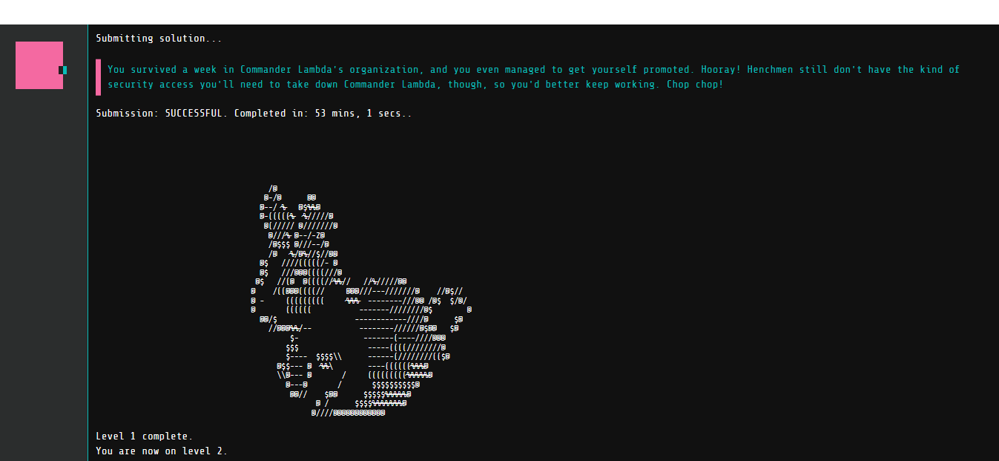
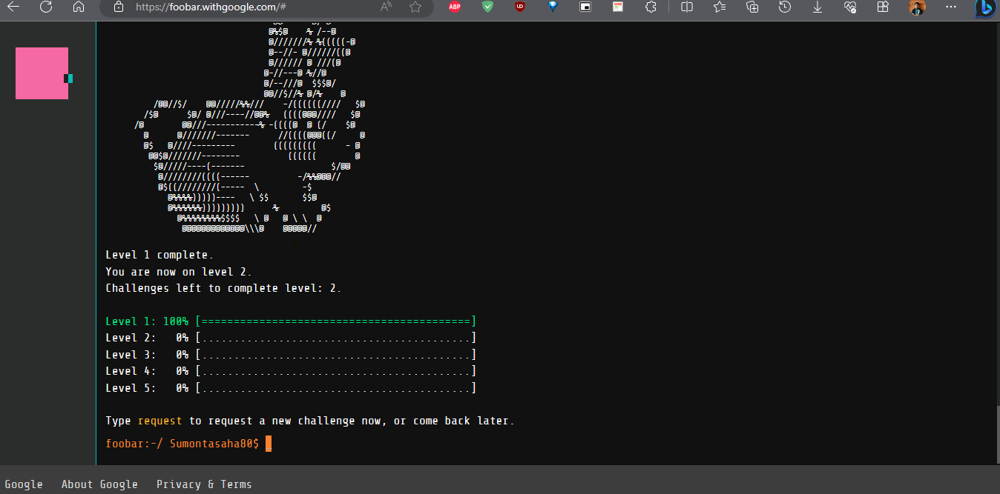
</div>


 <div align = "center">

 <h3>😊 Now Let's Face the Level 2 Challenge - 1 😊</h3>

</div>


##### 👉 Step 1: Requesting for next question Level 2 Challenge 1
```code
    - foobar:~/ Sumontasaha80$ request      
    // It means you are requesting for your first question of the challenge
```

##### 👉 Step 2: Level 2 Challenge 1 Problem : "Ion-Flux-Relabeling" 🙁

##### 👉 Step 3: Now to get the question and its constraints need to write the following commands 🙁
```code
    - foobar:~/ Sumontasaha80$ ls                            // list the contents of the current directory

    ** Output : **
    journal.txt
    ion-flux-relabeling
    start_here.txt

    - foobar:~/ Sumontasaha80$ cd ion-flux-relabeling             // change your working directory to folder ion-flux-relabeling
    - foobar:~/ion-flux-relabeling Sumontasaha80$ ls               // list the contents of the current directory
    
    ** Output : **
    Solution.java
    constraints.txt
    readme.txt
    solution.py
```

##### 👉 Step 4: How to get the question of challenge 1 level 2
```code
    - foobar:~/ion-flux-relabeling Sumontasaha80$ cat readme.txt
```
<div align = "center">
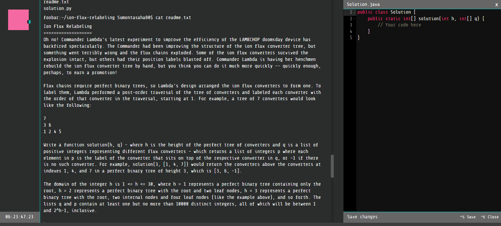
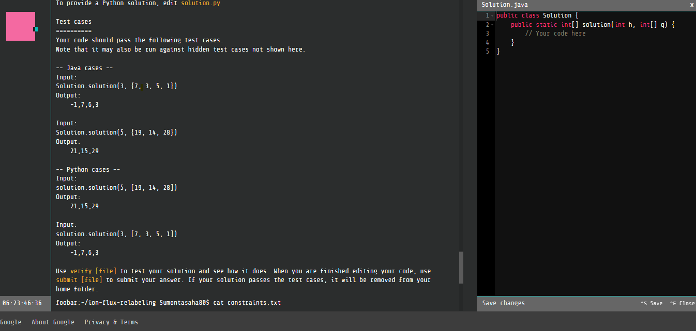
</div>

##### 👉 Step 5: How to get the constraints of challenge 1 level 2
```code
    - foobar:~/ion-flux-relabeling Sumontasaha80$ cat constraints.txt
```
<div align = "center">
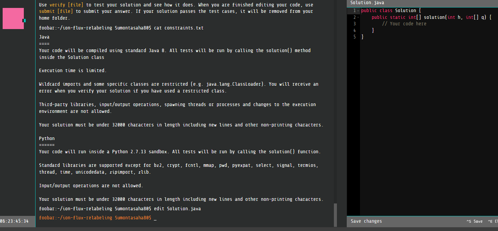
</div>

##### 👉 Step 6: How to Submit the Solution of challenge 1 level 2
```code
    // Open Code Terminal First
    - foobar:~/ion-flux-relabeling Sumontasaha80$ edit Solution.java

    // Paste or Write the Solution    
    // Save the solution

    // Verify the solution with constraints
    - foobar:~/ion-flux-relabeling Sumontasaha80$ verify Solution.java

    // If all the constraints matched
    **Output:**
    Verifying solution...
    All test cases passed. 

    // For Final Submission 
    - foobar:~/ion-flux-relabeling Sumontasaha80$ submit Solution.java

    **Output:**
    Are you sure you want to submit your solution?
    [Y]es or [N]o: Y
    Submitting solution...

```


##### 👉 Step 7: I Successfully Completed Challenge 1 Level 2 🥳🥳🥳

<div align = "center">
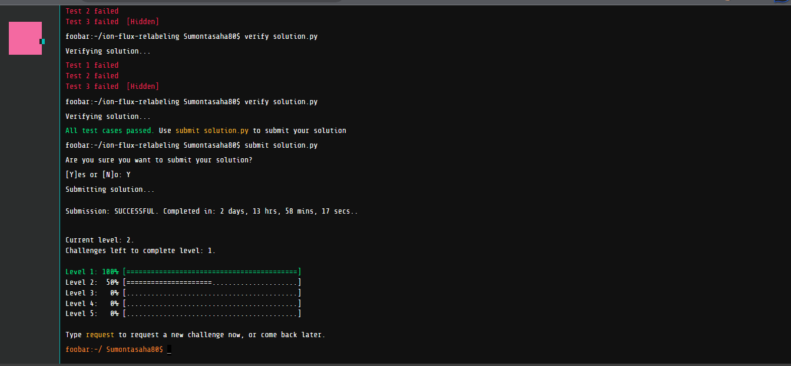
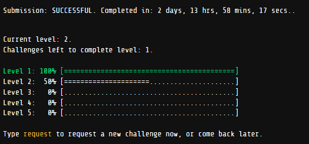
</div>


 <div align = "center">

 <h2>😯 Level - 2 ( 50% Completed ) 😯</h2>

 <h3>😊 Now Let's Face the Level 2 Challenge - 2 😊</h3>

</div>

<div align = "center">
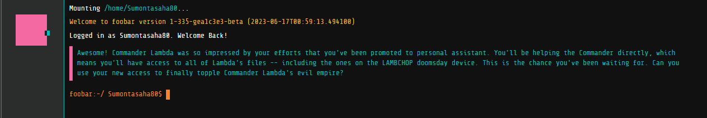

</div>

##### 👉 Step 1: Requesting for next question Level 2 Challenge 2
```code
    - foobar:~/ Sumontasaha80$ request      
    // It means you are requesting for your next question of the challenge
```

##### 👉 Step 2: Level 2 Challenge 2 Problem : "Numbers-Station-Coded-Messages" 🙁

##### 👉 Step 3: Now to get the question and its constraints need to write the following commands 🙁
```code
    - foobar:~/ Sumontasaha80$ ls                            // list the contents of the current directory

    ** Output : **
    journal.txt
    numbers-station-coded-messages
    start_here.txt

    - foobar:~/ Sumontasaha80$ cd numbers-station-coded-messages           // change your working directory to folder numbers-station-coded-messages
    - foobar:~/numbers-station-coded-messages Sumontasaha80$ ls               // list the contents of the current directory
    
    ** Output : **
    Solution.java
    constraints.txt
    readme.txt
    solution.py
```

##### 👉 Step 4: How to get the question of challenge 2 level 2
```code
    - foobar:~/numbers-station-coded-messagesSumontasaha80$ cat readme.txt
```
<div align = "center">
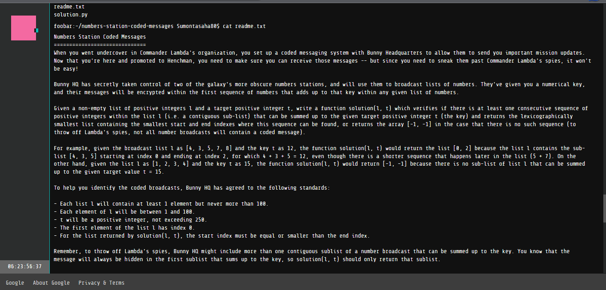
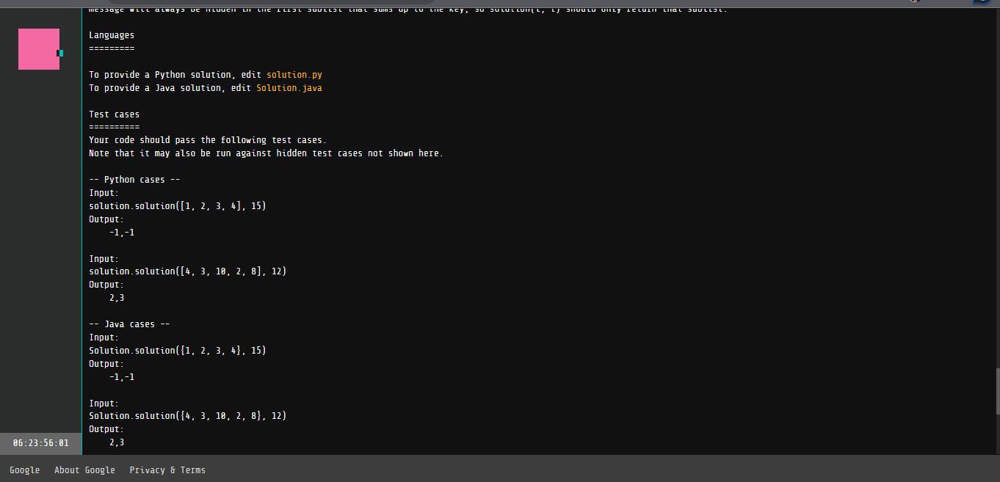
</div>

##### 👉 Step 5: How to get the constraints of challenge 2 level 2
```code
    - foobar:~/numbers-station-coded-messages Sumontasaha80$ cat constraints.txt
```
<div align = "center">
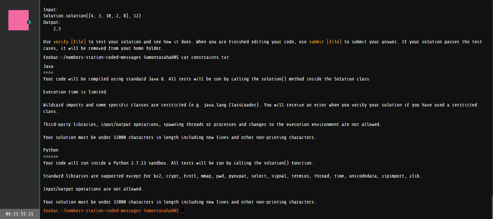
</div>

##### 👉 Step 6: How to Submit the Solution of challenge 2 level 2
```code
    // Open Code Terminal First
    - foobar:~/numbers-station-coded-messages Sumontasaha80$ edit Solution.java

    // Paste or Write the Solution    
    // Save the solution

    // Verify the solution with constraints
    - foobar:~/numbers-station-coded-messages Sumontasaha80$ verify Solution.java

    // If all the constraints matched
    **Output:**
    Verifying solution...
    All test cases passed. 

    // For Final Submission 
    - foobar:~/numbers-station-coded-messages Sumontasaha80$ submit Solution.java

    **Output:**
    Are you sure you want to submit your solution?
    [Y]es or [N]o: Y
    Submitting solution...

```


##### 👉 Step 7: I Successfully Completed Challenge 2 Level 2 🥳🥳🥳

<div align = "center">
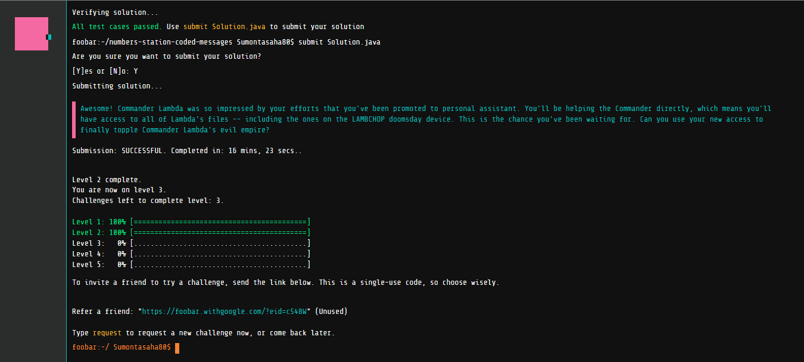
</div>


 <div align = "center">

 <h2>😯 Level - 2 ( 100% Completed ) 😯</h2>

 

 <h3>😊 Now Let's Face the Level 3 Challenge - 1 😊</h3>

</div>
